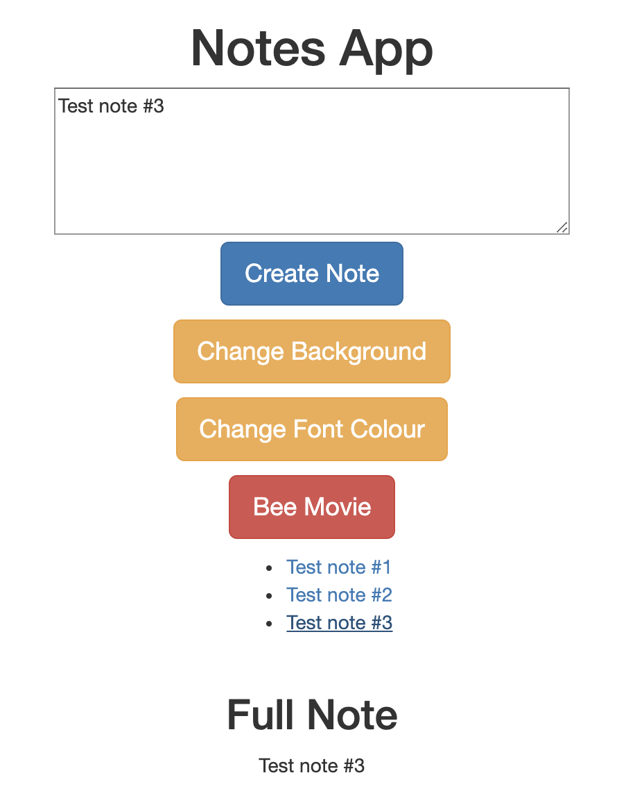

### [Makers Academy](http://www.makersacademy.com) - Week 7 Pair programming challenge 

# [Notes app](http://icy-knowledge.surge.sh/) 📝

#### Technologies: Javascript, HTML, CSS, Surge 

[Task](#Task) | [Installation Instructions](#Installation) | [Functional Description](#Functional_Description) | [User Stories](#User_Stories) | [Further improvements](#Further_Improvements)



This app is hosted at: http://icy-knowledge.surge.sh/

## <a name="Task">The Task</a>

Write a frontend, single page app using only pure JavaScript.

This challenge is the sixth afternoon pair programming challenge at [Makers Academy](https://github.com/makersacademy).

## <a name="Installation">Installation Instructions</a>

1. Fork this repository, clone to your local machine then change into the directory:
```
$ git clone git@github.com:davmcgregor/notes-js.git
$ cd notes-js
```
2. Test were written using test helper code in spec/JavaScriptTesting.js

3. Run the app on a local server and use on the broswer:
```
$ open index.html
```

## <a name="Functional_Description">Functional Description</a>

The app has the following specifications:
1. A user can write a note
2. A user can write multiple notes
3. Notes are saved to a list
4. Clicking on a saved note will show the full note text  

## <a name="User_Stories">User Stories</a>
```
As a programmer
I can see a list of my notes, where each note is abbreviated to the first 20 characters
So I can find the one I want
```
```
As a programmer
I can create a new note
So I can record something I need to remember
```
```
As a programmer
I can see the full text of an individual note on its own page
So I can see all the information in the note
```

## <a name="Further_Improvements">Further Improvements</a>
* Add further styling
* Add CRUD functionality